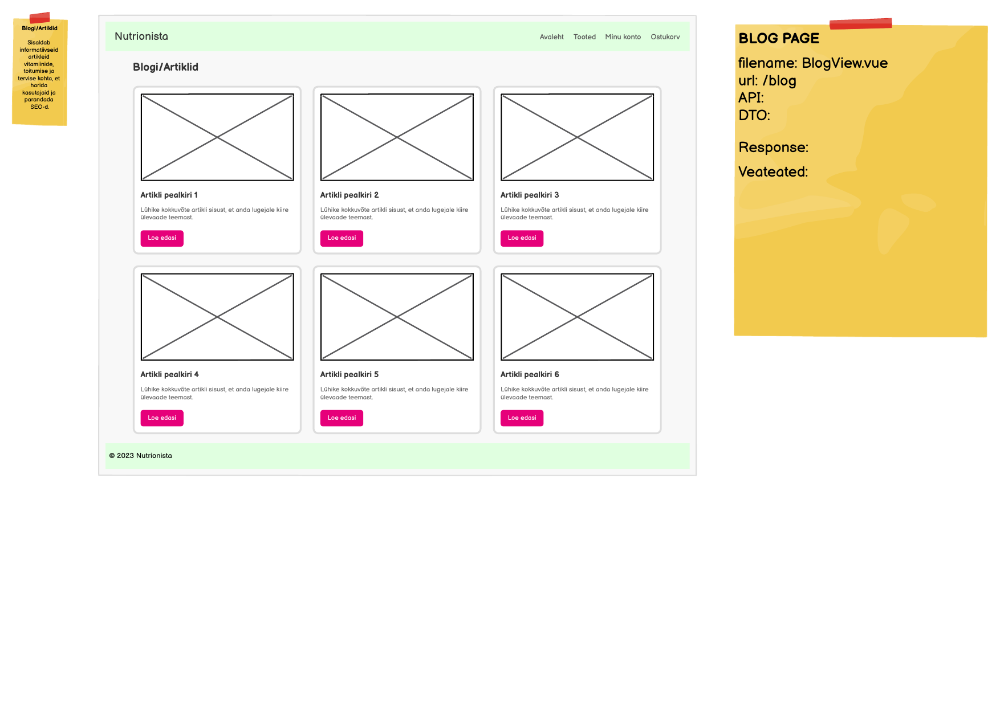

# GET /api/blog

**Kontroller:** `BlogController.java`
**Tüüp:** Backend
**Staatus:** To Do

## Mockup



## Kontekst

BlogView (`/blog`) kuvab artiklite nimekirja kaardina — igal kaardil on pilt, pealkiri, lühikokkuvõte ja "Loe edasi" nupp. Leht on avalik (autentimine pole nõutav) ja selle eesmärk on hariva sisuga kasutajaid harida ning parandada SEO-d. See endpoint tagastab kõigi avaldatud artiklite kokkuvõtted.

## API leping

| Väli | Väärtus |
|------|---------|
| Meetod | `GET` |
| Tee | `/api/blog` |
| Auth | Ei |

### Request Body

Puudub — GET päring.

### Response Body — `BlogArticleSummaryDto.java`

> Schema: [`BlogArticleSummaryDto_schema.json`](../../dtos/schema/BlogArticleSummaryDto_schema.json)
> Näidis: [`BlogArticleSummaryDto_BlogView_Array_example.json`](../../dtos/examples/BlogArticleSummaryDto_BlogView_Array_example.json)

Tagastatakse **nimekiri** (`List<BlogArticleSummaryDto>`).

| Väli | Tüüp | Kirjeldus |
|------|------|-----------|
| `id` | `Long` | Artikli unikaalne ID |
| `title` | `String` | Artikli pealkiri |
| `summary` | `String` | Lühike kokkuvõte (kaardil kuvatav tekst) |
| `imageUrl` | `String` | Pildi URL (nt `/api/blog/{id}/image`) |

## Veahaldus

| Olukord | Exception klass | ErrorResponse enum | HTTP staatus |
|---------|----------------|-------------------|--------------|
| Üldine serveri viga | `RuntimeException` | *(lisa vajadusel)* | `500` |

> **Märkus veahalduse kohta:**
> Kontrolli, kas vajalikud `ErrorResponse` enum kirjed ja exception klassid juba eksisteerivad:
> - `backend/src/main/java/ee/nutrionista/infrastructure/error/ErrorResponse.java`
> - `backend/src/main/java/ee/nutrionista/infrastructure/exception/`
>
> GET-nimekirja endpoint tavaliselt erindi ei viska (tagastab tühja nimekirja kui artikleid pole). Kui lisad filtreerimist tulevikus, lisa siis ka vastavad vead.

## Andmebaas

> **Tähelepanu:** Andmebaasi skeemis (`2_create.sql`) puudub `blog_article` tabel.
> Enne endpointi arendamist tuleb see tabel luua ja lisada `2_create.sql` faili.

Soovituslikud veerud uuele `blog_article` tabelile:

| Veerg | Tüüp | Selgitus |
|-------|------|----------|
| `id` | `SERIAL` | Primaarvõti |
| `title` | `VARCHAR(255)` | Artikli pealkiri |
| `summary` | `VARCHAR(500)` | Lühikokkuvõte kaardile |
| `content` | `TEXT` | Täistekst (kasutatakse üksikvaates) |
| `image_data` | `BYTEA` | Pildi binaarne sisu (nagu `nutrient_image`) |
| `created_at` | `TIMESTAMP` | Loomise aeg |

Näidis-SQL:
```sql
CREATE TABLE blog_article (
    id         SERIAL        NOT NULL,
    title      VARCHAR(255)  NOT NULL,
    summary    VARCHAR(500),
    content    TEXT,
    image_data BYTEA,
    created_at TIMESTAMP     NOT NULL DEFAULT CURRENT_TIMESTAMP,
    CONSTRAINT blog_article_pk PRIMARY KEY (id)
);
```

Seotud tabelid: `blog_article` *(tuleb luua)*

## Vastuvõtu kriteeriumid

- [ ] `GET /api/blog` tagastab `200 OK` ja artiklite nimekirja JSON-formaadis
- [ ] Tühi nimekiri (`[]`) tagastatakse kui artikleid pole — mitte viga
- [ ] `blog_article` tabel on loodud ja lisatud `2_create.sql` faili
- [ ] `3_import.sql` failis on vähemalt 3 näidisartiklit
- [ ] `BlogArticleSummaryDto_schema.json` on loodud `docs/dtos/schema/` kausta
- [ ] `BlogArticleSummaryDto_BlogView_Array_example.json` on loodud `docs/dtos/examples/` kausta
- [ ] Controller, Service, Repository kihid on eraldatud
- [ ] Kontrolleri meetodil on `@Operation` annotatsioon
- [ ] Swagger UI kaudu on endpoint nähtav ja testitav (`http://localhost:8080/swagger-ui.html`)