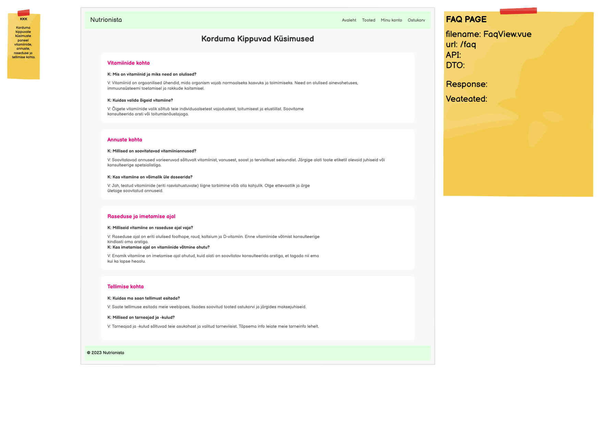

# GET /api/faq-items

**Kontroller:** `FaqController.java`
**Tüüp:** Backend
**Staatus:** To Do

## Mockup



## Kontekst

FaqView (`/faq`) kuvab korduma kippuvad küsimused kategooriatesse grupeeritult (nt "Vitamiinide kohta", "Annuste kohta", "Raseduse ja imetamise ajal", "Tellimise kohta"). Iga kirje sisaldab küsimust ja vastust. Leht on avalik — autentimine pole nõutav. Frontend grupeerib kirjed `section` välja järgi arvutatud omaduses `grouped`.

## API leping

| Väli | Väärtus |
|------|---------|
| Meetod | `GET` |
| Tee | `/api/faq-items` |
| Auth | Ei |

### Request Body

Puudub — GET päring.

### Response Body — `FaqItemDto.java`

> Schema: [`FaqItemDto_schema.json`](../../dtos/schema/FaqItemDto_schema.json)
> Näidis: [`FaqItemDto_FaqView_Array_example.json`](../../dtos/examples/FaqItemDto_FaqView_Array_example.json)

Tagastatakse **nimekiri** (`List<FaqItemDto>`).

| Väli | Tüüp | Allikas (DB tabel.veerg) |
|------|------|--------------------------|
| `id` | `Long` | `faq_item.id` |
| `section` | `String` | `faq_item.section` |
| `question` | `String` | `faq_item.question` |
| `answer` | `String` | `faq_item.answer` |

## Veahaldus

| Olukord | Exception klass | ErrorResponse enum | HTTP staatus |
|---------|----------------|-------------------|--------------|
| Üldine serveri viga | `RuntimeException` | *(lisa vajadusel)* | `500` |

> **Märkus veahalduse kohta:**
> GET-nimekirja endpoint tavaliselt erindi ei viska — tühi nimekiri (`[]`) tagastatakse kui kirjeid pole.
> Kontrolli olemasolevaid enum kirjeid ja exception klasse:
> - `backend/src/main/java/ee/nutrionista/infrastructure/error/ErrorResponse.java`
> - `backend/src/main/java/ee/nutrionista/infrastructure/exception/`

## Andmebaas

> **Tähelepanu:** Andmebaasi skeemis (`2_create.sql`) puudub `faq_item` tabel.
> Enne arendust tuleb see tabel luua.

Soovituslik SQL:

```sql
CREATE TABLE faq_item (
    id       SERIAL        NOT NULL,
    section  VARCHAR(255)  NOT NULL,
    question VARCHAR(500)  NOT NULL,
    answer   TEXT          NOT NULL,
    CONSTRAINT faq_item_pk PRIMARY KEY (id)
);
```

Seotud tabelid: `faq_item` *(tuleb luua)*

Kõik andmed loetakse `faq_item` tabelist. Grupeerimine toimub frontendis `section` välja järgi — backend tagastab tasase nimekirja.

## Vastuvõtu kriteeriumid

- [ ] `GET /api/faq-items` tagastab `200 OK` ja KKK kirjete nimekirja JSON-formaadis
- [ ] Tühi nimekiri (`[]`) tagastatakse kui kirjeid pole — mitte viga
- [ ] `faq_item` tabel on loodud ja lisatud `2_create.sql` faili
- [ ] `3_import.sql` failis on vähemalt 4 näidiskirjet erinevate sektsioonidega
- [ ] `FaqItemDto_schema.json` on loodud `docs/dtos/schema/` kausta
- [ ] `FaqItemDto_FaqView_Array_example.json` on loodud `docs/dtos/examples/` kausta
- [ ] Controller, Service, Repository kihid on eraldatud
- [ ] Kontrolleri meetodil on `@Operation` annotatsioon
- [ ] Swagger UI kaudu on endpoint nähtav ja testitav