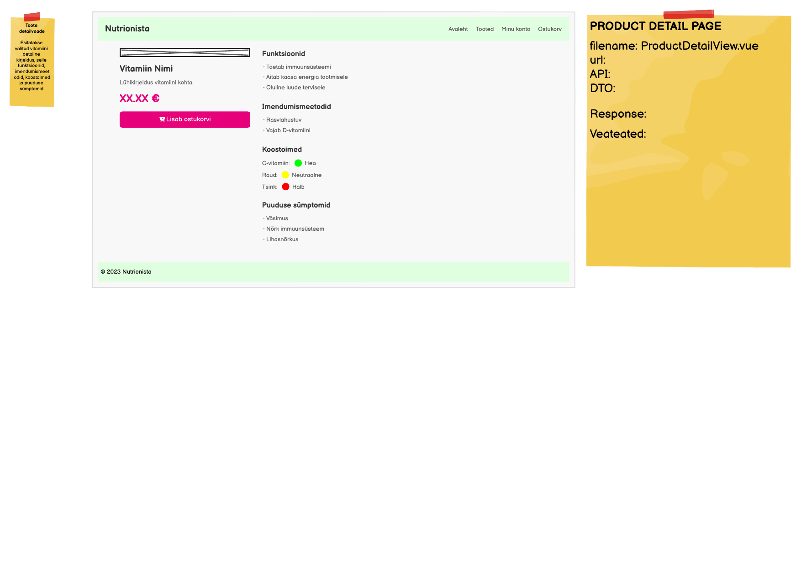

# GET /api/nutrients/{id}

**Kontroller:** `NutrientController.java`
**Tüüp:** Backend
**Staatus:** To Do

## Mockup



## Kontekst

ProductDetailView (`/product/:id`) kuvab ühe toote detailinfo — nime, kirjelduse, hinna, kategooria ja "Lisa ostukorvi" nupu. Frontend kutsub `GET /api/nutrients/{id}` marsruudi parameetri `id` põhjal. Endpoint kasutab olemasolevat `NutrientController`, `NutrientService`, `NutrientRepository`, `NutrientMapper` ja `NutrientDto` infrastruktuuri.

> **Tähelepanu — frontend mismatch:**
> Frontend kasutab `product.category?.name`, aga `NutrientDto`-s on väli `categoryName` (String).
> Uuenda `ProductDetailView.vue`-s: `product.category?.name` → `product.categoryName`

## API leping

| Väli | Väärtus |
|------|---------|
| Meetod | `GET` |
| Tee | `/api/nutrients/{id}` |
| Auth | Ei |

### Request Body

Puudub — GET päring. `id` tuleb URL tee parameetrina (`@PathVariable`).

### Response Body — `NutrientDto.java`

> Schema: [`NutrientDto_schema.json`](../../dtos/schema/NutrientDto_schema.json)
> Näidis: [`NutrientDto_ProductDetailView_example.json`](../../dtos/examples/NutrientDto_ProductDetailView_example.json)

| Väli | Tüüp | Allikas (DB tabel.veerg) |
|------|------|--------------------------|
| `nutrientId` | `Integer` | `nutrient.id` |
| `name` | `String` | `nutrient.name` |
| `description` | `String` | `nutrient.description` |
| `categoryName` | `String` | `category.name` |
| `price` | `BigDecimal` | `nutrient.price` |
| `stockQuantity` | `Integer` | `nutrient.stock_quantity` |

## Veahaldus

| Olukord | Exception klass | ErrorResponse enum | HTTP staatus |
|---------|----------------|-------------------|--------------|
| Toodet antud `id`-ga ei leita | `NutrientNotFoundException` | `NUTRIENT_NOT_FOUND` | `404` |

> **Märkus veahalduse kohta:**
> - Lisa `NUTRIENT_NOT_FOUND` enum kirje `ErrorResponse.java`-sse
> - Loo `NutrientNotFoundException.java` `infrastructure/exception/` kausta (järgi `BadCredentialsException` mustrit)
> - Registreeri `RestExceptionHandler.java`-s

## Andmebaas

Seotud tabelid: `nutrient`, `category`

`JpaRepository.findById(id)` tagastab `Optional<Nutrient>` — kui tühi, viska `NutrientNotFoundException`.

## Muudatused olemasolevatesse failidesse

**`NutrientService.java`** — lisa meetod:
```java
public NutrientDto findNutrientById(Integer id) {
    Nutrient nutrient = nutrientRepository.findById(id)
            .orElseThrow(NutrientNotFoundException::new);
    return nutrientMapper.toNutrientDto(nutrient);
}
```

**`NutrientController.java`** — lisa meetod:
```java
@GetMapping("/nutrients/{id}")
@Operation(summary = "Ühe aine andmed")
public NutrientDto findNutrientById(@PathVariable Integer id) {
    return nutrientService.findNutrientById(id);
}
```

## Vastuvõtu kriteeriumid

- [ ] `GET /api/nutrients/{id}` tagastab `200 OK` ja toote andmed
- [ ] Olematu `id` puhul tagastab `404` koos `NUTRIENT_NOT_FOUND` veaga
- [ ] `NutrientNotFoundException.java` on loodud `infrastructure/exception/` kausta
- [ ] `NUTRIENT_NOT_FOUND` on lisatud `ErrorResponse` enum-isse
- [ ] `RestExceptionHandler.java`-s on registreeritud `NutrientNotFoundException`
- [ ] `NutrientDto_ProductDetailView_example.json` on loodud `docs/dtos/examples/` kausta
- [ ] `ProductDetailView.vue`-s uuendatud `product.category?.name` → `product.categoryName`
- [ ] Swagger UI kaudu on endpoint nähtav ja testitav