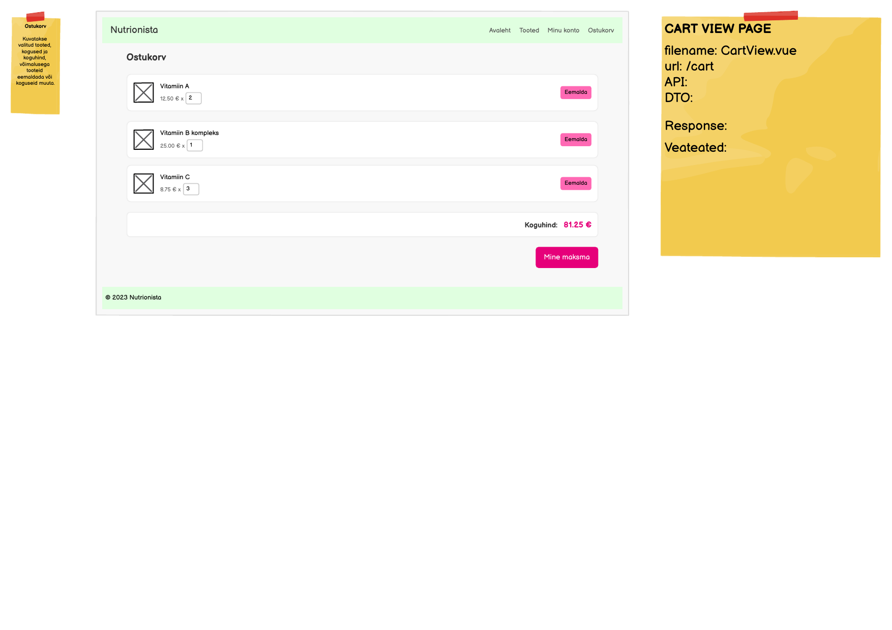

# GET /api/users/{userId}/cart

**Kontroller:** `CartController.java`
**Tüüp:** Backend
**Staatus:** To Do

## Mockup

## Kontekst

CartView (leht 8) laadib lehe avamisel kasutaja ostukorvi koos kõigi ridadega. See endpoint tagastab korvi sisu või loob uue tühja korvi, kui kasutajal ei ole veel `cart` rida andmebaasis (lazy create). Frontend kutsub seda `beforeMount` hoos läbi `cartStore.fetch(userId)`. Sama lehe teised endpointid: `POST /api/carts/{cartId}/items` (lisamine), `PUT /api/cart-items/{id}` (koguse muutmine), `DELETE /api/cart-items/{id}` (rea eemaldamine), `DELETE /api/carts/{cartId}/items` (korvi tühjendamine).

## API leping

| Väli | Väärtus |
|------|---------|
| Meetod | `GET` |
| Tee | `/api/users/{userId}/cart` |
| Auth | Jah — sisselogitud kasutaja |

### Request Body

Puudub — GET päring

### Response Body — `CartDto.java`

> Schema: [`CartDto_schema.json`](../../dtos/schema/CartDto_schema.json)
> Näidis: [`CartDto_CartView_example.json`](../../dtos/examples/CartDto_CartView_example.json)

**CartDto:**

| Väli | Tüüp | Allikas (DB tabel.veerg) |
|------|------|--------------------------|
| `cartId` | `Long` | `cart.id` |
| `userId` | `Long` | `cart.user_id` |
| `items` | `List<CartItemDto>` | vt allpool |

**CartItemDto (pesastatud):**

| Väli | Tüüp | Allikas (DB tabel.veerg) |
|------|------|--------------------------|
| `cartItemId` | `Long` | `cart_item.id` |
| `nutrientId` | `Long` | `cart_item.nutrient_id` |
| `name` | `String` | `nutrient.name` |
| `price` | `BigDecimal` | `nutrient.price` |
| `imageId` | `Long` | `nutrient_image.id` (esimene pilt) |
| `quantity` | `Integer` | `cart_item.quantity` |

## Veahaldus

| Olukord | Exception klass | ErrorResponse enum | HTTP staatus |
|---------|----------------|-------------------|--------------|
| Kasutajat ei leita antud ID-ga | `UserNotFoundException` | `USER_NOT_FOUND` | 404 |

> **Märkus veahalduse kohta:**
> Kontrolli, kas vajalikud `ErrorResponse` enum kirjed ja exception klassid juba eksisteerivad:
> - `backend/src/main/java/ee/nutrionista/infrastructure/error/ErrorResponse.java`
> - `backend/src/main/java/ee/nutrionista/infrastructure/exception/`
>
> Puuduvate enum kirjete puhul lisa need `ErrorResponse`-i. Puuduvate exception klasside puhul loo uus klass `exception/` paketti (järgi olemasolevate klasside mustrit) ja registreeri see `RestExceptionHandler`-is.

## Andmebaas

Seotud tabelid: `cart`, `cart_item`, `"user"`, `nutrient`, `nutrient_image`

Endpoint otsib `cart` tabelist rida `user_id` järgi. Kui rida puudub, luuakse uus `cart` rida (lazy create, `INSERT`). Seejärel laaditakse kõik seotud `cart_item` read koos `nutrient.name`, `nutrient.price` ja esimese `nutrient_image.id`-ga. Kui nutriendil pole ühtegi pilti, on `imageId` väärtus `null`.

## Vastuvõtu kriteeriumid

- [ ] `GET /api/users/{userId}/cart` olemasoleva kasutajaga tagastab `200 OK` ja `CartDto` koos `items` listiga
- [ ] Kui kasutajal pole veel korvi, luuakse see automaatselt ja tagastatakse tühja `items` listiga
- [ ] Korduvkutsed on idempotentsed — uut korvi ei looda, kui juba eksisteerib
- [ ] `GET /api/users/{userId}/cart` olematu `userId`-ga tagastab `404` koos `USER_NOT_FOUND` veaga
- [ ] `CartDto` ja `CartItemDto` klassid on loodud Java klassidena õigesse paketti
- [ ] `UserNotFoundException` on loodud `exception/` paketti ja registreeritud `RestExceptionHandler`-is
- [ ] `USER_NOT_FOUND` kirje on lisatud `ErrorResponse` enum-i
- [ ] Controller, Service, Repository kihid on eraldatud
- [ ] Kontrolleri meetodil on `@Operation` annotatsioon
- [ ] Swagger UI kaudu on endpoint nähtav ja testitav