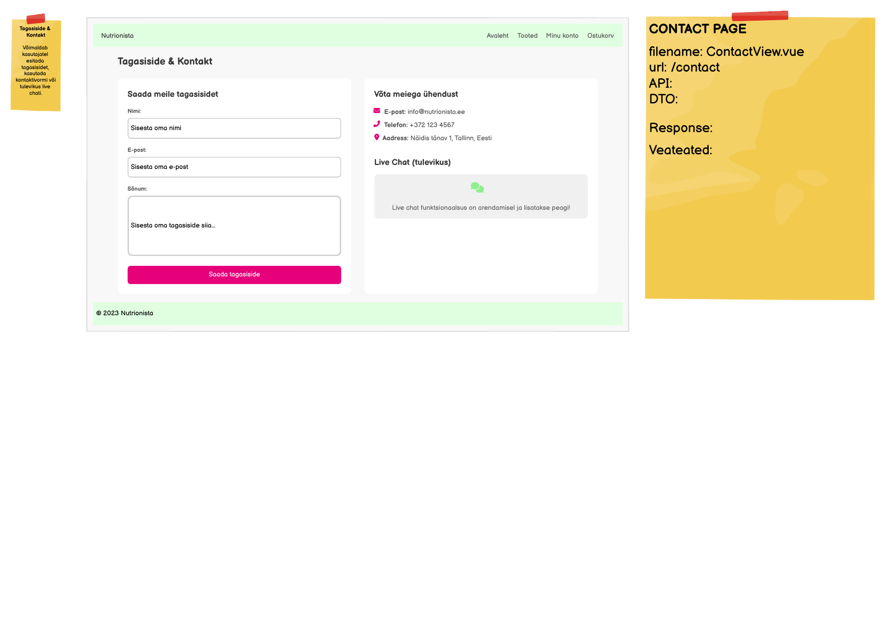

# POST /api/feedback

**Kontroller:** `FeedbackController.java`
**Tüüp:** Backend
**Staatus:** To Do

## Mockup

## Kontekst

ContactView (`/contact`) sisaldab tagasiside vormi väljadega nimi, e-post ja sõnum. Kasutaja täidab vormi ja vajutab "Saada tagasiside" — frontend saadab andmed `POST /api/feedback` endpointile. Leht on avalik, autentimine pole nõutav. Andmebaasis on `feedback` tabel juba olemas.

## API leping

| Väli | Väärtus |
|------|---------|
| Meetod | `POST` |
| Tee | `/api/feedback` |
| Auth | Ei |

### Request Body — `FeedbackDto.java`

> Schema: [`FeedbackDto_schema.json`](../../dtos/schema/FeedbackDto_schema.json)
> Näidis: [`FeedbackDto_ContactView_example.json`](../../dtos/examples/FeedbackDto_ContactView_example.json)

| Väli | Tüüp | Kirjeldus |
|------|------|-----------|
| `name` | `String` | Saatja nimi |
| `email` | `String` | Saatja e-posti aadress |
| `message` | `String` | Tagasiside sõnum |

### Response Body

Puudub — HTTP 200 tühi vastus (tagasiside salvestatud).

## Veahaldus

| Olukord | Exception klass | ErrorResponse enum | HTTP staatus |
|---------|----------------|-------------------|--------------|
| Kohustuslik väli on tühi | `MethodArgumentNotValidException` | *(Bean Validation käsitleb automaatselt)* | `400` |

> **Märkus veahalduse kohta:**
> Kasuta `@Valid` annotatsiooni kontrolleris ja `@NotBlank` annotatsioone DTO väljadel — Spring käsitleb valideerimise vead automaatselt `400 Bad Request`-iga.
> Kontrolli olemasolevaid enum kirjeid ja exception klasse:
> - `backend/src/main/java/ee/nutrionista/infrastructure/error/ErrorResponse.java`
> - `backend/src/main/java/ee/nutrionista/infrastructure/exception/`

## Andmebaas

Seotud tabelid: `feedback`

Kõik vormi väljad (`name`, `email`, `message`) kirjutatakse `feedback` tabelisse. `created_at` täidetakse automaatselt (`DEFAULT CURRENT_TIMESTAMP`) — seda DTO-s ei saadeta.

## Vastuvõtu kriteeriumid

- [ ] `POST /api/feedback` tagastab `200 OK` pärast edukat salvestamist
- [ ] Tühi `name`, `email` või `message`: tagastab `400 Bad Request`
- [ ] `FeedbackDto_schema.json` on loodud `docs/dtos/schema/` kausta
- [ ] `FeedbackDto_ContactView_example.json` on loodud `docs/dtos/examples/` kausta
- [ ] DTO väljadel on `@NotBlank` annotatsioonid
- [ ] Kontrolleris on `@Valid` annotatsioon request body-l
- [ ] Controller ja Service kihid on eraldatud (Repository pole eraldi vaja — kasuta `FeedbackRepository`)
- [ ] Kontrolleri meetodil on `@Operation` annotatsioon
- [ ] Swagger UI kaudu on endpoint nähtav ja testitav