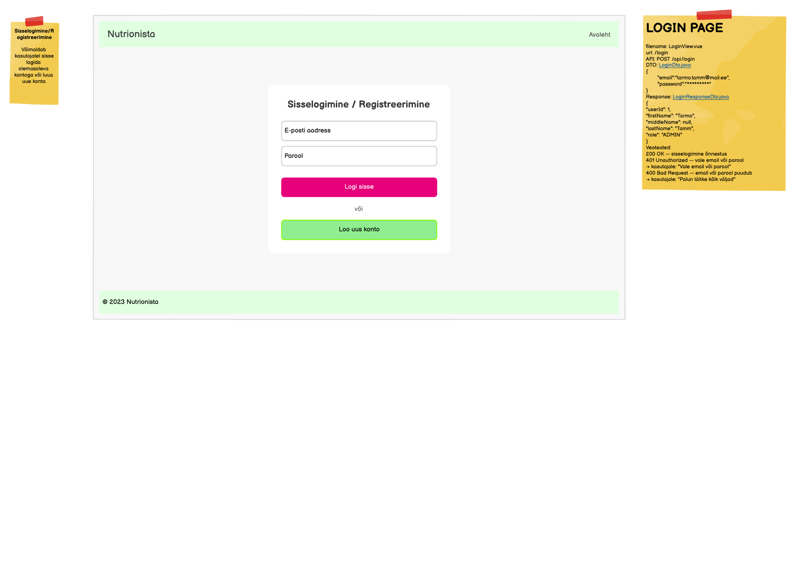

# POST /api/login

**Kontroller:** `LoginController.java`
**Tüüp:** Backend
**Staatus:** To Do

## Mockup



## Kontekst

LoginView on sisselogimise leht, kus kasutaja sisestab e-posti aadressi ja parooli. Edukas sisselogimine tagastab kasutaja põhiandmed (nimi, roll), mida frontend kasutab seansi haldamiseks ja rolli-põhiseks navigatsiooniks. Leht sisaldab ka "Loo uus konto" nuppu, kuid see kuulub eraldi registreerimise endpointi alla.

## API leping

| Väli | Väärtus |
|------|---------|
| Meetod | `POST` |
| Tee | `/api/login` |
| Auth | Ei |

### Request Body — `LoginDto.java`

> Schema: [`LoginDto_schema.json`](../../dtos/schema/LoginDto_schema.json)
> Näidis: [`LoginDto_LoginView_example.json`](../../dtos/examples/LoginDto_LoginView_example.json)

| Väli | Tüüp | Kirjeldus |
|------|------|-----------|
| `email` | `String` | Kasutaja e-posti aadress |
| `password` | `String` | Kasutaja parool (plaintext, BCrypt kontroll teenuses) |

### Response Body — `LoginResponseDto.java`

> Schema: [`LoginResponseDto_schema.json`](../../dtos/schema/LoginResponseDto_schema.json)
> Näidis: [`LoginResponseDto_LoginView_example.json`](../../dtos/examples/LoginResponseDto_LoginView_example.json)

| Väli | Tüüp | Allikas (DB tabel.veerg) |
|------|------|--------------------------|
| `userId` | `Long` | `user.id` |
| `firstName` | `String` | `contact.first_name` |
| `middleName` | `String` | — DB-s puudub, tagastada `null` |
| `lastName` | `String` | `contact.last_name` |
| `role` | `String` | `role.name` |

> **DB lahknevus:** `middleName` on mock response-is olemas, kuid DB `contact` tabelis puudub `middle_name` veerg. Tagastada alati `null`, kuni veerg lisatakse skeemi.

## Veahaldus

| Olukord | Exception klass | ErrorResponse enum | HTTP staatus |
|---------|----------------|-------------------|--------------|
| Vale email või parool | `BadCredentialsException` | `INCORRECT_CREDENTIALS` | 401 |
| Email või parool puudub (tühi väli) | `MissingFieldsException` | `MISSING_FIELDS` | 400 |

> **Märkus veahalduse kohta:**
> Kontrolli, kas vajalikud `ErrorResponse` enum kirjed ja exception klassid juba eksisteerivad:
> - `backend/src/main/java/ee/nutrionista/infrastructure/error/ErrorResponse.java`
> - `backend/src/main/java/ee/nutrionista/infrastructure/exception/`
>
> `INCORRECT_CREDENTIALS` (401) ja `BadCredentialsException` on juba olemas.
>
> `MISSING_FIELDS` (400) puudub — lisa `ErrorResponse` enumisse:
> ```java
> MISSING_FIELDS("Palun täitke kõik väljad", 400),
> ```
> Loo uus `MissingFieldsException.java` klassi `exception/` paketti, järgides `BadCredentialsException` mustrit. Registreeri see `RestExceptionHandler`-is.

## Andmebaas

Seotud tabelid: `user`, `contact`, `role`

Sisselogimisel otsitakse kasutajat `user.username` järgi. Leitud kasutaja `password_hash` kontrollitakse BCrypt-iga vastu sisestatud parooli. Eduka kontrolli korral loetakse `contact.first_name`, `contact.last_name` (JOIN `contact ON contact.user_id = user.id`) ning `role.name` (JOIN `role ON role.id = user.role_id`).

## Vastuvõtu kriteeriumid

- [ ] `POST /api/login` õigete andmetega tagastab `200 OK` ja õige `LoginResponseDto` keha
- [ ] Vale email või parool: tagastab `401` koos `INCORRECT_CREDENTIALS` veaga
- [ ] Tühi email või parool: tagastab `400` koos `MISSING_FIELDS` veaga
- [ ] Kõik DTO klassid (`LoginDto`, `LoginResponseDto`) on loodud Java klassidena õigesse paketti
- [ ] Controller, Service, Repository kihid on eraldatud
- [ ] Kontrolleri meetodil on `@Operation` annotatsioon
- [ ] Swagger UI kaudu on endpoint nähtav ja testitav
